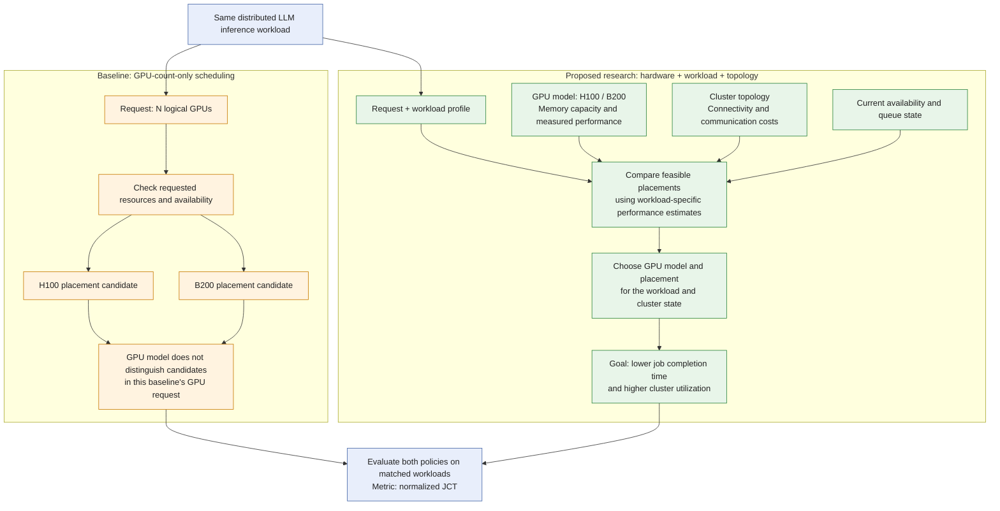

# Topology- and Workload-Aware GPU Scheduling

Research on GPU scheduling for distributed large language model (LLM) inference across heterogeneous GPU clusters using **Ray** and **NVIDIA Dynamo**.

## Overview

This research aims to develop topology- and workload-aware GPU scheduling strategies that improve cluster utilization and reduce job completion time. It evaluates distributed LLM inference scheduling across heterogeneous GPU clusters using **normalized Job Completion Time (JCT)**.

## Research Focus

- **Topology-aware scheduling:** Account for cluster topology when making GPU placement and scheduling decisions.
- **Workload-aware scheduling:** Incorporate inference workload characteristics into scheduling strategies.
- **Heterogeneous GPU clusters:** Study scheduling across clusters containing GPUs with different capabilities.
- **Distributed LLM inference:** Explore scheduling strategies using Ray and NVIDIA Dynamo.

## Objectives

1. Improve GPU cluster utilization.
2. Reduce job completion time for distributed LLM inference workloads.
3. Evaluate scheduling strategies using normalized JCT.

## How This Approach Differs

The comparison below uses a **GPU-count-only baseline**: a Ray task or actor requests a number of GPUs without an accelerator-type constraint or a workload-specific hardware preference. This is a baseline configuration, not a limitation of all Ray scheduling.

*Conceptual design, not measured results. H100 and B200 are illustrative GPU models; the diagram does not imply a fixed performance ranking or confirm which hardware was used in experiments. Performance estimates and queue-aware decisions are proposed design inputs.*

| Decision dimension | GPU-count-only baseline | Proposed research policy |
| --- | --- | --- |
| GPU request | Number of logical GPUs | GPU count plus hardware and workload information |
| H100 versus B200 | No model preference expressed | Compare workload-specific suitability |
| Workload characteristics | No hardware performance model in this baseline | Use workload profiles to inform placement |
| Interconnect topology | No explicit communication-cost model in this baseline | Consider communication costs between GPUs and nodes |
| Placement objective | Satisfy resource requests under the configured scheduler | Aim to reduce JCT and improve utilization |
| Evidence | Reference policy for experiments | Benefits must be established through matched experiments |

**Ray capability note:** Ray supports accelerator-type constraints and custom resources, so it would be inaccurate to say Ray cannot distinguish GPU models. The research distinction is the proposed policy for choosing among feasible hardware and topology options based on workload characteristics. Accelerator-type filtering alone does not establish that policy. See [Ray accelerator support](https://docs.ray.io/en/latest/ray-core/scheduling/accelerators.html) and [Ray logical resources](https://docs.ray.io/en/latest/ray-core/scheduling/resources.html).

## Evaluation

Normalized JCT is the stated evaluation metric. The exact normalization baseline, job boundaries, aggregation method, hardware configurations, and workload definitions will be documented with the experiment artifacts to support reproducible comparisons.

## Repository Status

This repository currently contains the research overview. Implementation code, experiment configurations, datasets or workload traces, reproduction instructions, and quantitative results have not yet been added.
