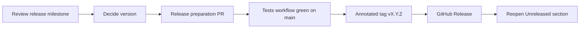

# Release process

This guide defines how a tested commit on `main` becomes a published version:
which version number to choose, what must be true before tagging, how the
annotated tag and GitHub Release are created, what the release notes must
contain, and what to do when a release turns out to be wrong.

Following this guide does not publish anything. Creating a tag is a separate
deliberate act performed by a maintainer.



## Versioned surface

Semantic versioning only means something once the compatible surface is named.
For this repository a version promise covers:

- the names exported from `topology_scheduler`;
- the signatures and documented behavior of those callables, including
  `choose_placement()`, `discover_planner_nodes()`, and the backend execution
  entry points;
- the fields of the public data models, such as `Node`, `Workload`,
  `GPUConnection`, and the Ray node inventory;
- the shape of the machine-readable planning and execution records;
- the backend selectors accepted by `run_with_record()`, currently the names
  `ray` and `kai` plus a caller-supplied callable; and
- the supported Python version and the integration versions pinned in
  `pyproject.toml`.

A version promise does not cover module-private names, the scripts under
`examples/`, test layout and fixtures, documentation wording, or the internal
structure of the policy implementation.

Planner scores are a separate case. The cost model is an experimental input,
not an interface, so tuning a constant is not by itself an incompatible change.
It is still a behavior change: a release that alters which placement the
planner selects for unchanged inputs must say so in the changelog and in the
release notes, because downstream comparisons depend on it.

## Version rules

The project is below 1.0. Under
[Semantic Versioning 2.0.0](https://semver.org/spec/v2.0.0.html) a major
version of zero means the public API is not yet stable, so the guarantees sit
one position to the right of where they will after 1.0.

| Change | While 0.x | After 1.0 |
| --- | --- | --- |
| Incompatible change to the versioned surface | minor | major |
| New backwards-compatible capability | minor | minor |
| Fix, documentation, or internal change that leaves the surface intact | patch | patch |

Additional rules:

- A breaking change is never shipped as a patch, even while the project is at
  0.x. Raise the minor version and describe the break under **Compatibility**
  in the release notes.
- Raising a dependency floor or changing a pin, such as the pinned Ray version,
  is at least a minor change because it changes what a user must install.
- Removing an entry from **Known limitations** is not a version bump on its
  own. The change that removed the limitation determines the version.
- Deciding the impact is a human judgment. Nothing in this repository infers a
  version from commit messages or labels, and no tooling should be assumed to.
- Documentation-only work normally waits and ships with the next release rather
  than earning a tag of its own.

Release candidates are optional. When one is useful, tag it `vX.Y.Z-rc.N`,
mark the GitHub Release as a pre-release, and never reuse the candidate number.
The final `vX.Y.Z` is always a separate tag, even when it points at the same
commit as the last candidate.

The published 0.1.1 release predates this guide. It added
`discover_planner_nodes()`, which these rules would classify as a minor change.
The rules apply from the next release forward; earlier tags are not revised.

## What blocks a release

Issue #18 proposes four milestones: Topology Discovery, Dynamo Integration,
Evaluation, and Next Release. They do not exist in the repository yet. Once
they do, only **Next Release** gates a tag: each issue in it must be closed, or
moved out with a comment explaining the deferral, before the tag is created.
Until the milestones exist, the release manager makes that judgment explicitly
in the release pull request instead.

The research milestones do not block a release. Open experimental work is the
normal state of this repository; it is disclosed under **Known limitations** in
the release notes rather than held against the tag.

Independent of any milestone, a release is blocked when:

- the Tests workflow is not green on the exact commit to be tagged;
- `python scripts/check_docs.py --run-examples` fails, which also means the
  version table in [current status and versions](current-status.md) has drifted
  from `pyproject.toml` and the contracts;
- the `Unreleased` section of `CHANGELOG.md` does not match the merged code;
- documented behavior in the README or `docs/` no longer matches the code; or
- a known defect makes a documented workflow fail.

Validation claims are their own gate. If the release notes would report
real-GPU results, the evidence must exist and be linked. Where it does not, the
notes state plainly that the feature was exercised only against simulated
logical GPUs, mocked backends, or synthetic inputs.

## Release checklist

Steps 1 through 9 happen on a branch and merge through an ordinary pull
request. Nothing is tagged until step 11.

1. Review the Next Release milestone. Close, or explicitly defer, every issue
   in it.
2. Confirm the Tests workflow is green on `main`.
3. Reconcile `CHANGELOG.md` against what actually merged since the previous
   tag. See [drafting release notes](#drafting-release-notes) for the commands
   that list it. Every user-visible entry needs its implementation pull request
   or merged-commit link, per the documentation update rules in
   [Contributing](../CONTRIBUTING.md).
4. Decide the version using the [version rules](#version-rules) and record the
   reasoning in the release pull request description.
5. Set `version` in `pyproject.toml` to the chosen version.
6. Update the version table in [current status and versions](current-status.md)
   to match, along with any status row the release changes.
7. Convert the `Unreleased` heading to `## [X.Y.Z] - YYYY-MM-DD`, keeping the
   `Added`, `Changed`, `Known limitations`, and `Planned` subsections that
   apply, and update the link definitions at the bottom of the file so
   `[Unreleased]` compares against the new tag and `[X.Y.Z]` compares against
   the previous one.
8. Update the README and any guide in `docs/` whose commands, public API,
   assumptions, or limitations changed.
9. Run `python scripts/check_docs.py --run-examples` from the repository root
   and fix what it reports.
10. Merge the pull request and wait for the Tests workflow to pass on the
    resulting `main` commit. That commit is the release commit.
11. Create the annotated tag on the release commit.
12. Push the tag.
13. Create the GitHub Release from the tag with reviewed release notes.
14. Open a fresh empty `Unreleased` section in `CHANGELOG.md` for the next
    cycle.

## Tagging

Tags are annotated, never lightweight, so that the tagger, date, and release
message are recorded in the object itself. The existing `v0.1.0` and `v0.1.1`
tags are both annotated; that is the standard to keep.

The tag name is `vX.Y.Z` with a leading lowercase `v` and no other prefix or
suffix. The tag message is a single line naming the version and the headline of
the release, following the existing `V0.1.1 automatic GPU inventory` form.

```bash
git checkout main
git pull --ff-only
git log -1 --oneline
git tag -a v0.2.0 -m "V0.2.0 KAI backend and topology discovery"
git push origin v0.2.0
```

Before pushing, confirm the tag points where it should:

```bash
git show v0.2.0 --stat --no-patch
git describe --exact-match --tags HEAD
```

A tag must point at a commit that is on `main` and has a passing Tests run.
Tagging a branch commit, a commit with a failing or missing check, or a commit
that only exists locally is a defect in the release, not a detail to fix later.

## GitHub Release

Create the Release from the pushed tag, titled `vX.Y.Z`, with the notes
described below. The tag is the source of truth; the Release is the readable
presentation of it.

```bash
gh release create v0.2.0 --title "v0.2.0" --notes-file release-notes.md
```

Keep `release-notes.md` out of the repository: it is a scratch file for the
`gh` invocation, not a tracked artifact. Mark release candidates with
`--prerelease`.

## Drafting release notes

Start from the changelog section for the version, then check it against what
merged. Neither source is sufficient alone: the changelog can lag, and pull
request titles describe work rather than user-visible behavior.

```bash
git log --oneline v0.1.1..HEAD
git diff --stat v0.1.1..HEAD
git log -1 --format=%cs v0.1.1
gh pr list --state merged --base main --limit 100 \
  --search "merged:>=2026-09-14" --json number,title,mergedAt,url
```

Substitute the previous release tag for `v0.1.1`. The third command prints that
tag's commit date, which is the value to pass to `merged:>=` so the pull request
list covers the same range as the commit list.

Every draft is reviewed by hand before publication. Generated text is a
starting point; the maintainer is responsible for the claims in it, especially
validation claims.

Release notes contain these sections, omitting any that is genuinely empty:

```markdown
## Features
What a user can now do that they could not before.

## Fixes
Defects corrected, with the observable symptom.

## Validation
What was actually run: unit tests, examples, mocked backends, simulated
logical GPUs, or physical hardware. Name the hardware and link the evidence
when a real-GPU run is claimed. Say so plainly when none was run.

## Compatibility
Supported Python version, pinned integration versions, and any incompatible
change with the migration a user must perform.

## Known limitations
What remains unimplemented, unmeasured, or observational, carried forward from
the changelog's known-limitations entries.
```

The **Known limitations** section is not optional padding. This repository is
an experimental foundation, and a release that omits its boundaries overstates
what it does.

## Rollback and corrections

A published tag is immutable. It is never moved, deleted, or reused after a
GitHub Release or any announcement references it. Corrections ship as a new
version.

- **Wrong content in a published release.** Fix it on `main` and release the
  next patch version. Add a `Fixed` entry to the changelog naming the version
  that was affected.
- **A release that should not be used.** Keep the tag, edit the GitHub Release
  body to state at the top that the version is withdrawn and which version
  replaces it, and record the withdrawal in the changelog. Deleting the
  Release hides the warning from anyone who already has the version.
- **A tag pushed by mistake, with no Release and no announcement.** Delete it
  with `git push origin :refs/tags/vX.Y.Z` and tell anyone who may have fetched
  it. That version number is spent: the next attempt uses the next patch
  version, so a given number never describes two different commits.
- **A wrong version number chosen for real content.** Do not retag. Publish the
  correct version next and explain the skip in its changelog entry.
- **A bad state on `main`.** Revert through a pull request like any other
  change. Do not rewrite the history that a published tag points into.

## Current state

[Current status and versions](current-status.md) is the shared summary of what
is implemented and which pins apply; this section covers only what bears on the
next release, and does not restate it.

The repository has annotated tags `v0.1.0` and `v0.1.1` and no published GitHub
Releases. Both tags predate this process and are left as they are. Releases for
them may be created retroactively from their changelog sections, or skipped.

`pyproject.toml` declares `0.1.2` as a development version, and no `v0.1.2` tag
exists. A development version is a placeholder, not a commitment: the value is
decided by the [version rules](#version-rules) at release preparation, not by
the number already sitting in the file.

The `Unreleased` section holds substantial new capability: the KAI Scheduler
adapter and backend selection, intra-node GPU topology discovery with the
public `GPUConnection` model, five reference baseline policies, the V1 Dynamo
contract, and the documentation validation rules. Under the version rules that
is a minor change while at 0.x, so the first candidate under this process is
**0.2.0**, which means raising `pyproject.toml` from `0.1.2` at step 5 of the
checklist rather than tagging the development value as-is.

That candidate is a proposal, not a decision. It holds only if a review of the
merged work confirms the changelog is complete and no incompatible change was
missed, and the release still waits on the Next Release milestone from issue
#18 being defined and cleared.
